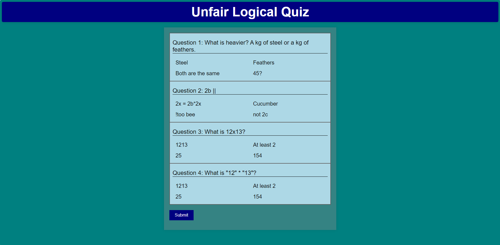
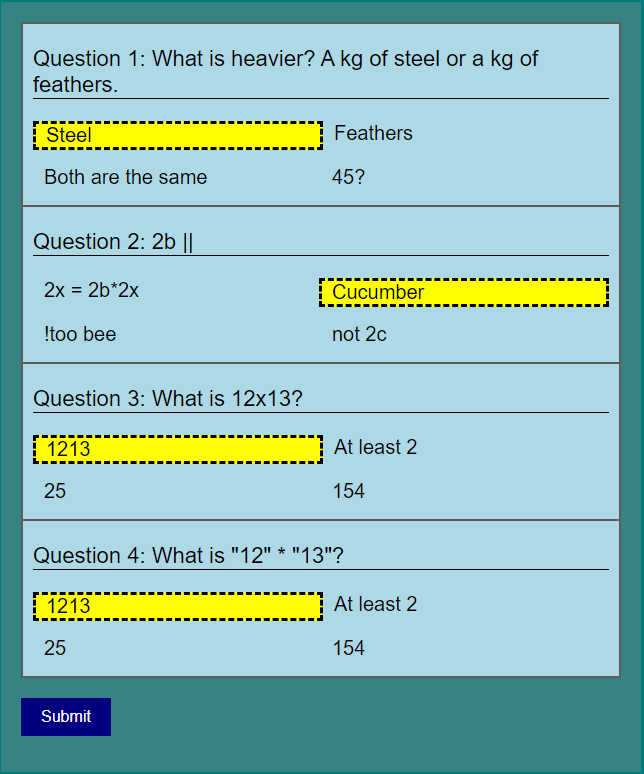
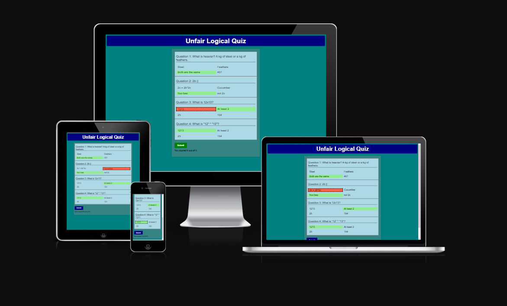

# The Unfair Logical Quiz

Welcome to The Unfair Logical Quiz. It is a web-based quiz application that challenges your logic with a series of tricky questions. It's designed to be a fun and entertaining way to test your knowledge and intuition and see how well you can answer unconventional questions.

## Features

### Quiz Structure

The quiz consists of four questions, each with multiple-choice answers. Here's how the quiz is structured:

- **Question 1:** What is heavier? A kg of steel or a kg of feathers.
- **Question 2:** 2b ||
- **Question 3:** What is 12x13?
- **Question 4:** What is "12" * "13"?

### User Interaction

- Select your answers by clicking on the options provided. The selected answer will be highlighted.
- Click the "Submit" button to see your score immediately.

## Styling

### Color Palette

To maintain the theme of the quiz, I've used a color palette inspired by the concept of "unfairness":

- The background is teal, reminiscent of the unfairness of life's twists and turns.
- The questions are presented in light blue, representing the uncertainty of unconventional questions.
- Correct answers are highlighted in light green, while incorrect answers turn tomato red.

### Responsive Design

The quiz is designed to be responsive, ensuring an appealing experience on various devices, including laptops, tablets, and smartphones.

## How to Play

1. Read each question carefully.

2. Click on one of the provided answers to select it. Your selected answer will be highlighted.

3. After answering all questions, click the "Submit" button to see your score.

4. Your score will be displayed at the bottom of the page, indicating how many correct answers you provided out of 4.

5. Challenge your friends to beat your score first try and prove that logic can be unfair!

## Testing

### Validator Testing

- HTML: No errors were returned when passing through the official W3C validator.
- CSS: No errors were found when passing through the official Jigsaw validator.

### Unfixed Bugs

In rare cases, social media icons may not load. This issue could be due to the icons themselves or a potential coding mistake.

## Deployment

The quiz was deployed to GitHub Pages. Follow these steps to deploy your own version:

1. In your GitHub repository, go to the Settings tab.
2. In the "Code and automation" section, click on the "Pages" tab.
3. Choose the source as "Deploy from branch" and select the main/root branch.
4. Optionally, set up a custom domain if desired.
5. Save your settings, and you'll find the link to your live quiz at the top of the page.

[Play the Unfair Logical Quiz](https://yourquizlinkhere.com)

## Credits

### Content

- Quiz questions and concepts inspired by unconventional logic puzzles.

### Media

- Images used in this README are sourced from [Stock Adobe](https://stock.adobe.com).

Enjoy the Unfair Logical Quiz and have fun testing your unconventional logic skills! If you have any questions or suggestions, feel free to [contact us](mailto:your.email@example.com).

